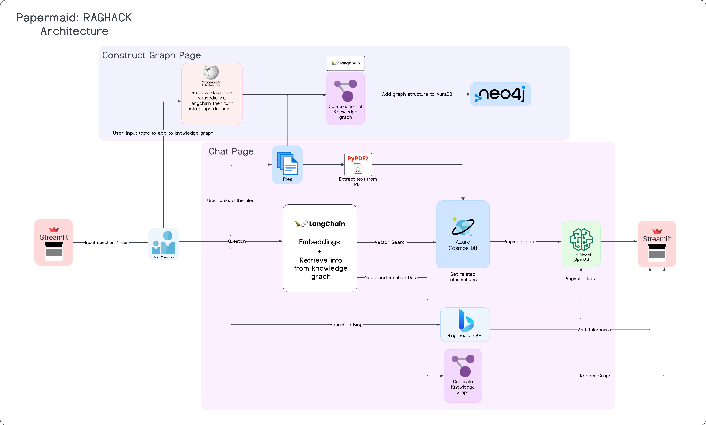

# Papermaid: Help you understand your paper

## About

## Installation

1. Clone this repository

```bash
git clone https://github.com/papermaid/papermaid.git
cd papermaid
```

2. Create virtual environment

```bash
python -m venv venv

# Window
.\venv\Scripts\activate

# MacOS/Linux
source venv/bin/activate
```

3. Install requirements

```bash
pip install -r requirements.txt
```

4. Provide keys according to `sample.env`, create file call `.env` then put those keys in it
   Here are list of services we use

   - CosmosDB

   - OpenAI

   - Bing search API

   - AuraDB (or local Neo4J database)

5. Run application

```bash
streamlit run app/main.py
```

## Architecture



## Member

[Jwizzed](https://github.com/Jwizzed)
[ChaiyawutTar](https://github.com/ChaiyawutTar)
[Sosokker](https://github.com/Sosokker)
